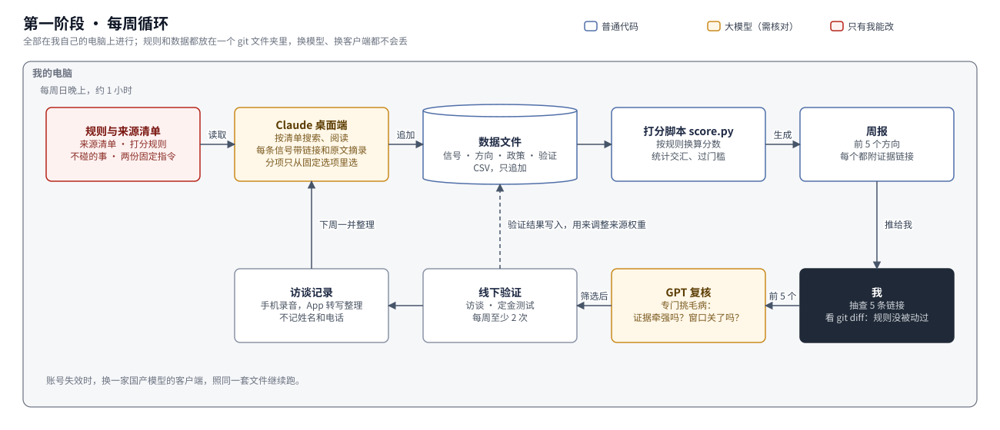
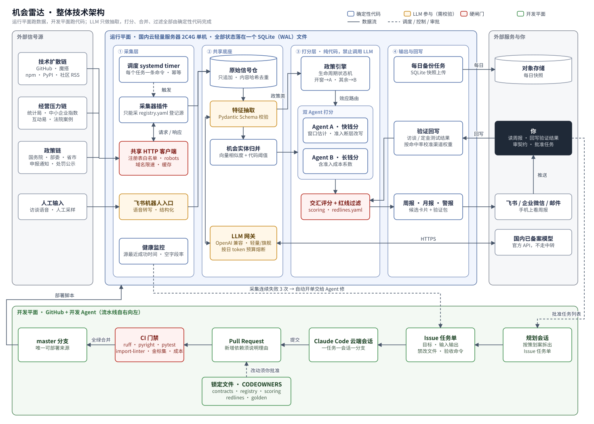

# 机会雷达策划案

2026 年 10 月 · 第 4 稿

这份文档说明我为什么要做一个"机会雷达"，它怎么工作，打算怎么建，以及什么情况下停掉它。前两节讲来龙去脉；第三到六节讲它看什么、怎么打分，两个阶段通用；第七、八节分别是两个阶段的具体做法。只想知道这个周末要干什么，直接看第七节。

---

## 一、背景

### 我的情况

我目前在一家互联网大厂做后端架构，平时的工作是高并发系统、分布式架构和稳定性治理。我想在工作之外做一门自己的生意，条件和限制都比较明确。

时间方面，我仍然在职，能投入的只有周末，每周大约 16 小时。这是整件事最紧的约束，比钱紧得多。

资金方面，我没有负债，有一笔积蓄可以用来试错，几个方向做不成也不会影响生活。手上还有 Claude、GPT 和其他几家模型的订阅，可以直接拿来用。

做法方面，我希望前期一个人就能把一门生意跑通，也就是有客户付钱、现金流为正，之后再考虑加人。日常的获客、交付、对账尽量交给程序和 AI Agent 去跑，我自己负责系统设计和关键判断。

方向偏好上，我更想做面向企业的生意，最好是客户会按月持续付费的那种。原因很简单：一次性的活儿，每个月都要重新找客户，周末时间撑不住。

### 之前看过的方向

过去一段时间，我认真分析过几个具体方向。

第一个是帮在美国有海外仓的中国卖家核对仓储和物流账单。仓库计费出错很常见，比如体积重量被多算、附加费超出约定时段，一年下来能占到履约支出的几个百分点。第二个是帮中国背景企业的美国子公司满足美国司法部的数据安全新规。第三个是刷卡手续费审计。

分析下来有两个结论。

第一，"用大模型读单据、再按规则核对"这一层已经不值钱了。刷卡费审计已经有工具免费提供，三方仓账单审计也有好几家在做，甚至有开源项目。我的工程能力能把事情做得更稳，但单靠这一点挡不住别人。

第二，判断一个方向值不值得做，我主要靠的是零散的信息和感觉。每次讨论，结论都会随着新看到的一篇报道或一个数据而变。照这样下去，时间会耗在反复讨论上，而不是验证上。

所以我想先解决"怎么持续、有依据地找方向"这个问题，再去做具体的生意。

### 两种钱

讨论过程中，我把机会分成了两类。

一类是快钱，来自新技术普及时出现的断层。一项新能力刚出来，很多人想用，但不会装、用不起或者不放心，这时候帮人部署、教人使用、做二次封装，都能赚到钱。今年的两个例子：一是"龙虾"，也就是 OpenClaw 这类个人 AI 助手的部署热潮；二是 GEO，帮品牌出现在 AI 回答里的优化服务。这类机会窗口短，通常两到六个月就会被大厂的一键方案关掉，拼的是速度和流量，我的工程背景帮不上多少忙。

另一类是长钱，来自老板经营压力的变化。成本上涨、回款变慢、多了一项合规义务，这些压力一旦出现就会持续好几年，老板也愿意按月花钱解决。这类机会拼的是系统靠不靠得住，正好是我的长处。

政策会同时影响这两类机会。一份鼓励新业态的文件可能打开一个快钱窗口，一项新的合规义务会催生长期需求，一次专项执法则会关掉某个灰色地带。所以政策要单独跟踪。

拿"回款"举个例子。根据国家统计局的数据，今年 8 月末，规模以上工业企业的应收账款有 29.48 万亿元，同比增长 9%，平均回收期 72.2 天，比去年同期又多了 0.9 天。私营企业的回收期是 75.6 天，比 2020 年 3 月疫情最严重时的 63.1 天还长。政策上，2025 年 9 月国务院办公厅印发通知，由五个部委联合治理大企业拖欠中小企业账款。技术上，现在的 AI 已经能读合同、对账、生成催款材料。经营压力、政策和技术三方面都指向同一件事，这就是一个值得去线下验证的候选。至于老板愿不愿意为此付钱，数据给不出答案，只能当面去问。

### 所以要做什么

我要做的是一个只给自己用的工具。它持续盯着这三类信号，每周推给我三到五个值得花一小时去验证的方向，并附上依据。我把省下来的时间用在线下：找老板聊、做定金测试。验证的结果再回填给工具，让它越用越准。

它不是要卖的产品，也替代不了和老板面对面聊。它只负责一件事：让我少花时间在"该看哪个方向"上，多花时间在"这个方向到底成不成"上。

判断它有没有用，标准只有一个：上线后 8 周内，至少有 1 个它推出来的方向通过了线下验证，也就是访谈确认了痛点，或者定金测试真有人付钱。

### 分两步走

在这件事被证明之前，花时间搭服务器、数据库和自动化流程，都是提前投入。所以分两个阶段。

第一阶段直接用我已经付费的 Claude 和 GPT 桌面端来跑：Claude 按清单去搜、去读、整理信号，一个小脚本负责打分，GPT 负责给结果挑毛病，所有东西都存在一个 git 文件夹里。一个周末就能出第一份周报，几乎不额外花钱。

第二阶段才把这套东西搬到自己的服务器上，改成每天自动跑。什么时候搬，第八节写了具体条件；条件不满足，就一直停在第一阶段。

---

## 二、整体思路

工具里有两套独立的打分逻辑。A 盯快钱，B 盯长钱，两者共用同一批数据和同一份政策跟踪。之所以分开，是因为两类机会差别太大，放在一起打分会互相干扰：

| | 快钱（A） | 长钱（B） |
|---|---|---|
| 需求从哪来 | 新技术普及时出现的断层 | 老板经营压力的变化 |
| 信号在哪 | 基本都在线上 | 一半在线下，要靠我录入 |
| 窗口多长 | 2 到 6 个月 | 1 到 3 年以上 |
| 谁付钱 | 个人和小团队，多为一次性 | 企业老板，持续付费 |
| 主要风险 | 进场太晚，或者踩到法律红线 | 成交慢，付费意愿不足 |
| 我的优势 | 弱 | 强 |

长钱是主线。B 推出来的方向默认排在 A 前面；A 的方向只有在窗口还够长、又不碰红线的时候才会推给我。快钱更多是用来观察市场和顺带获客的。

信号分三条线：技术普及、经营压力和政策。单看一条线，信号很可能是噪音；同一个方向在两条线上同时出现，才算候选；三条线都出现的，排在最前面。上面的回款就是三条线都出现的例子。

还有一条贯穿两个阶段的规矩：大模型只负责从原始材料里提取信息，打分、合并和过滤都按写死的规则由代码完成。这样每一个分数都能追溯到具体是哪几条原始信号算出来的，同样的材料这周和下周算出来的分数也一样。

---

## 三、快钱雷达（A）

A 盯和新技术相关的信号，找出刚出现的断层，并估计窗口还能开多久。

一个新能力从出现到被大厂收编，大致会经过五个阶段。A 在每个阶段盯不同的来源：

| 阶段 | 看哪里 | 看什么 |
|---|---|---|
| 新能力出现 | GitHub、魔搭、国内模型厂商公告；TrustMRR、Product Hunt、Hacker News、OpenRouter 应用排行 | 星标和 fork 的周增速、新模型、降价、新接口；海外已经有人赚到钱的新品类 |
| 开始普及 | npm 和 PyPI 下载量；linux.do、V2EX、掘金；巨量算数、百度指数、微信指数 | 下载量和讨论帖的周增速；固定关键词的搜索热度（每周手动查） |
| 出现摩擦 | GitHub issue、社区求助帖、企业应用市场差评；工信部 NVDB、CNCERT 风险提示 | 高频报错和"怎么才能……"一类的问题；安全预警 |
| 有人付钱 | 闲鱼、淘宝上的"代 X"服务；极客时间、小鹅通上的课程 | 新冒出来的服务品类、价格、销量（每周固定 20 个关键词手动看） |
| 大厂进场 | 阿里云、腾讯云、火山引擎、百度千帆的产品公告；融资新闻；工商新增注册 | 一键部署方案上线、同赛道融资、经营范围里出现新关键词的新公司数量 |

第一阶段只用其中一部分来源，见附录一。

窗口怎么判断：只走到前两个阶段的，说明还早，先放进观察列表，不推给我；出现摩擦或付费信号，说明窗口开了，推送；云厂商推出一键方案，说明窗口基本关了，对已经在跟的方向发一条提醒。如果海外已经有人赚到钱、国内还没有，就单独标出来，这类机会国内通常会晚几个月出现。

有一类断层要单独处理："用不了"，比如境外模型在国内无法使用。这类需求不直接丢掉，而是改写成合法的做法再打分。比如企业想要境外模型的能力，可以改成帮它接入已备案的国产模型，并做效果对比和迁移；出海企业要服务海外客户，可以由境外主体在当地合规使用。至于帮个人绕过限制、按次收费，不做，原因见第六节。

每期周报里，A 最多推 5 个方向。每个方向写清楚是什么断层、依据是哪些原始信号（附链接）、分数、估计的窗口，以及建议我先做什么验证。到了第二阶段每天跑的时候，某个方向增速突然变快、又第一次出现付费信号，会立刻单独提醒；第一阶段每周看一次，不做即时提醒。

---

## 四、长钱雷达（B）

B 盯经营压力相关的数据，再结合我录入的线下信息，找那些老板已经在持续花钱、却还没解决好的问题。

| 阶段 | 看哪里 | 看什么 |
|---|---|---|
| 压力出现 | 国家统计局工业企业财务数据（月度）；中国中小企业协会的中小企业发展指数（季度） | 应收账款回收期、存货周转天数、成本费用率，按行业和所有制拆开看同比变化；成本、资金、用工等分项指数 |
| 压力持续 | 上市公司年报、深交所互动易、上证 e 互动；法院公布的典型案例和纠纷白皮书 | 同行业公司披露的经营风险、投资者反复追问的问题；某类合同纠纷是否在变多 |
| 开始花钱 | 金蝶、用友等企业服务公司的财报；招聘网站（手动抽样）；人社部新职业和各地紧缺工种目录；线下访谈 | 哪些产品模块收入涨得快；对账、跟单、内勤这类重复性岗位的数量和薪资；新进入官方目录的岗位 |

线下信息的权重最高，因为老板真正的痛点很少写在网上。每次和人聊完，我花 5 分钟录一段语音，转写后整理成固定格式：对方是什么行业、多大规模、什么角色；痛点的原话；现在是谁在处理、用什么办法；每月在这件事上花多少钱或多少人力；多久发生一次，不解决每月损失多少；以及对方有没有追问我什么时候能做好、愿不愿意给真实数据或付定金。

处理顺序是：先用公开数据算出各行业压力的变化，找出恶化最快的几个行业；再针对这些行业去互动易、法院案例和招聘信息里找佐证；最后把线下访谈挂到对应的方向上，一起打分。

统计数据按月更新，所以 B 的行业压力排行每月更新一次（第一阶段单独写成一份 `周报/YYYY-MM-行业压力.md`），候选方向则和 A 一样每周进周报。到第二阶段，每个候选方向还会自动附一份验证材料：10 个访谈问题、一页定金测试的文案草稿、目标人群描述，以及建议从哪里找到这些人；第一阶段需要时，让 Claude 针对某个方向单独写一份。

---

## 五、政策跟踪

政策跟踪由 A 和 B 共用。它把每条政策当成一件会逐步推进的事来跟。

不同来源能提前多久看到政策，差别很大：

| 层级 | 来源 | 大概提前多久 |
|---|---|---|
| 规划 | 国务院年度立法工作计划 | 6 到 18 个月 |
| 征求意见 | 全国人大法律草案意见征集，司法部和各部委的征求意见稿 | 3 到 12 个月 |
| 正式发布 | 国务院政策文件库，各部委规章和通知 | 0 到 6 个月 |
| 地方落地 | 各省市配套细则和申报通知，国家标准和团体标准平台，网信办备案公告 | 需求集中爆发 |
| 执法 | 专项行动、行政处罚公示、两高典型案例、3·15 | 灰色地带关闭 |

重点盯网信办、工信部、发改委、市场监管总局、财政部和税务总局、人社部、国家数据局。

每条政策按"规划、征求意见、发布、施行、出细则、首批执法"的顺序往前推进，状态只能往前走；出了修订稿就另记一个版本，和原来的关联起来，不覆盖。从征求意见到正式施行的这段时间，就是我的准备期。

大模型负责从政策原文里提取发文机关、当前状态、施行日期、管的是哪些行业和多大规模的企业、新增了什么义务、罚则、涉及多少钱、有没有新增许可或备案要求。然后按规则判断这条政策属于哪一种（一条政策可以同时属于好几种）：

- 发钱：补贴、消费券、专项资金，带金额和申报期限。交给 B。
- 加义务：企业必须新做某件事，并且有罚则。交给 B。
- 给中小企业撑腰：给了新的维权手段或议价筹码，比如前面说的治理拖欠账款。交给 B。
- 开窗：鼓励某种新业态或新技术应用。交给 A。
- 关窗：禁止、整治或者开始执法。A 和 B 都要知道，相关方向直接过滤或标记窗口关闭。

---

## 六、怎么打分，哪些事不碰

所有分数都按规则文件来算，每个分项打 1 到 5 分。

快钱分 = 扩散速度 × 付费证据 × 窗口剩余

扩散速度看相关信号的周增速，按历史分位数折算成 1 到 5 分（第一阶段数据少，先按"本周新增信号数"分档，攒够 8 周数据后再换成分位数）。付费证据：没有付费信号是 1 分，有人上架服务或课程是 3 分，有销量或海外已经有人赚到钱是 5 分。窗口剩余：还没有大厂进场是 5 分，出现同赛道融资是 3 分，云厂商已经出了一键方案是 1 分。

长钱分 = 金额 × 频次 × 持续性 × 技术门槛 × 决策链 × 准入成本系数

金额是老板每月在这件事上的花费或损失，按 1 千、5 千、1 万、5 万元分档。频次：一年一次是 1 分，每月是 3 分，每天是 5 分。持续性：一次性事件是 1 分，由政策或行业结构驱动、能持续 3 年以上是 5 分。技术门槛：调个接口就能做是 1 分，需要高可靠、数据清洗、权限审计这类硬功夫是 5 分，这一项决定了我的长处能不能用上。决策链：要多个部门审批是 1 分，老板一个人就能拍板是 5 分。

### 分项怎么填

金额、频次、决策链这些分项，本身就需要判断。为了不让大模型直接"给个分"，分项的输入一律从固定选项里选，并且必须附上依据。比如金额要写"每月约 2 万元，依据：访谈第 12 号的原话"，频次只能在"每年、每季、每月、每周、每天"里选一个。选项到分数的换算、乘法和门槛判断都由脚本完成。我抽查时看的是依据站不站得住，而不是分数本身。

### 许可证怎么算

准入成本系数用来处理许可证的问题。一开始我把"需要许可证"直接当成红线，后来改了：许可证只要能合法办下来，就只是成本，关键看这个机会的回报够不够覆盖。系数按最难的那一项取：

| 情况 | 系数 | 例子（具体条件以主管部门最新要求为准） |
|---|---|---|
| 只需营业执照 | 1.0 | 给企业用的内部工具、私有化部署的软件 |
| 3 个月内、5 万元以内能办完，不需要专职人员 | 0.8 | 非经营性 ICP 备案、算法备案、软件著作权 |
| 要 6 到 12 个月，或者要求实缴注册资本、专职持证人员、固定场所 | 0.5 | 增值电信业务经营许可、代理记账许可、面向公众的生成式 AI 服务备案 |
| 个人拿不到，或者和我在职的身份冲突又没法安排 | 0，直接过滤 | 支付牌照、需要金融或医疗专业资质的业务 |

系数是 0.5 的方向照样推给我，但会附上办证的路径、大概要多久、花多少钱，由我判断值不值。

### 交汇和门槛

同一个方向在两条线上都有信号，总分乘 1.3；三条线都有，乘 1.6。A 的方向至少要覆盖两个阶段，并且至少有一条付费信号；B 的方向至少要有一条线下信号，或者至少两条带金额的公开信号。每期只推门槛以上的前 5 名，其余留在观察列表里。

### 不碰的事

下面这几类，不管分数多高，一律过滤：

第一，以帮别人突破访问限制为卖点的生意，比如帮人翻墙、做境外模型的中转或代充值、绕过平台的登录、验证码、接口签名或封禁。这一条讨论过要不要去掉，结论是保留。原因是已经有现成的教训：据公开报道，今年 5 月上海一家 API 中转站的站长，因为没有增值电信许可、接入的境外模型没在国内备案、用户数据出境没做评估，涉嫌非法经营罪被刑拘；4 月网信办的"清朗"专项行动也关停了数百个同类站点。自己用工具，和帮别人绕过限制并收钱，是两回事，后者属于经营行为。逆向平台接口还可能涉及"提供侵入、非法控制计算机信息系统程序、工具罪"，新修订的《反不正当竞争法》也限制用破坏技术措施的办法获取别的经营者的数据。我有一份稳定的工作和一份不错的职业前景，这类风险怎么算都不划算。

需要说清楚的是，低频读取不用登录的公开页面、遵守 robots 规则、主动控制访问频率，这些都没问题。判断标准是有没有绕过别人的技术措施，"没触发风控"不能当作合规的理由。

第二，个人拿不到的资质，也就是上表里系数为 0 的那一档。

第三，依赖规避已经生效的监管要求的生意，比如规避备案、生成内容标识或数据出境评估。

第四，已经被明令禁止的事，比如讨债、刷量、做虚假内容、数据投毒。

第五，政策跟踪里已经进入"执法"阶段的领域。

---

## 七、第一阶段：用现成的桌面端跑通

### 为什么先这样做

这个阶段要回答的问题只有一个："信号 → 候选方向 → 线下验证"这条链，能不能找出一个有人愿意付钱的方向。回答这个问题，不需要服务器，也不需要每天自动跑，每周一次、我在电脑前盯着跑就够了。我已经在付 Claude 和 GPT 的订阅，它们的桌面端能搜索网页、读写本地文件、运行脚本，足够把整个流程串起来。



### 分工

Claude 是主力。我在 Claude 桌面端里打开这个仓库，用一份固定的指令让它按来源清单去搜、去读，把找到的信号追加到数据文件里，把信号归到已有的方向下面（或者提议新方向），并按固定选项填好各个分项和依据。

打分脚本 `score.py` 负责算分。它读规则文件和数据文件，检查数据是否合规，换算分数、统计交汇、过门槛，生成当周周报。这个脚本已经写好，只用 Python 标准库，附带测试；它放在 `规则/` 目录里，Claude 不许改。

GPT 是复核员。每周我把周报里的前 5 个方向连同证据交给它，用另一份固定指令让它专门挑毛病：证据是不是牵强，链接内容和摘录对不对得上，窗口是不是其实已经关了，有没有明显的反例。两家模型交叉看，比一家自说自话可靠。这一步手动做，不需要自动化。

其他模型的订阅暂时不用，等某个环节确实需要时再加。

### 文件夹

所有东西都放在这个仓库的 `radar/` 目录里，用 git 管理：

```
radar/
  README.md              第一个周末的准备事项和每周操作步骤
  规则/                   只有我能改
    来源清单.csv
    打分规则.toml          所有选项的写法、换算表、交汇系数、门槛
    不碰的事.md
    每周采集指令.md         给 Claude 的固定指令
    复核指令.md            给 GPT 的固定指令
    score.py              打分脚本
  数据/                   信号只追加
    信号.csv
    方向.csv
    政策.csv
    验证.csv              由我自己填
  访谈/                   每次访谈一个文件，如 2026-10-12-五金加工.md；模板是 _模板.md
  周报/                   每周一期，如 2026-W42.md；每月一份行业压力表
  tests/                 score.py 的测试
```

各个文件的字段见附录二。这样放有两个好处：换模型、换客户端都不会丢东西；到第二阶段搬上服务器时，这些文件就是现成的初始数据。

### 每周怎么跑

每周日晚上，我在电脑前花大约 1 小时：

1. 在 Claude 桌面端里运行"每周采集指令"。如果那个时间电脑一定开着，也可以用桌面端自带的定时任务来触发；不确定就手动触发，反正每周只有一次。
2. Claude 跑完后，我看一眼 git diff：`规则/` 目录有没有被动过（动过就直接撤回），新增的每条信号是不是都有链接和原文摘录。
3. 运行 `score.py`，生成本周周报。
4. 随机点开 5 条证据链接，核对摘录是不是原文。
5. 把前 5 个方向交给 GPT 复核，复核意见补进周报。
6. 从剩下的方向里挑 1 到 2 个，安排这周的访谈或定金测试。

每月第一个周日，额外让 Claude 更新一次统计局和中小企业指数的数据，生成行业压力排行。

访谈在工作日随时做。聊完用手机录一段语音，用 Claude 或 GPT 的手机 App 转写并整理成第四节的模板，存进 `访谈/`，同时在 `验证.csv` 里记一条。只记行业、规模和角色，不记姓名和电话。

### 这个阶段要守住的几条

简化的是工具，不是规矩。下面几条不守，跑出来的结论就不可信，以后也搬不走：

分数由脚本算，不由对话算。在对话里让模型"综合判断打个分"，同样的材料这周 4 分、下周 2 分，我分不清是信号变了还是模型变了。

每条信号必须有链接和原文摘录。没有出处的信号，脚本直接忽略。

规则只有我能改。采集指令里写明不许改 `规则/`，每周再用 git diff 确认一遍。

状态只存在文件里，不存在聊天记录里。聊天记录换个客户端就没了，文件不会。

只用产品自带的功能。对话、项目、文件读写、定时任务都可以用；不要写脚本模拟点击网页版，也不要逆向桌面客户端当接口来调。这样做违反服务条款，账号容易被封，也和第六节"不绕过技术措施"那条冲突。

### 花多少时间和钱

文件夹、来源清单、打分规则、两份固定指令和 `score.py` 都已经建好并测过。第 1 个周末大约 3 到 4 小时：补上来源清单里还空着的几个入口网址（尤其是我所在省市的申报通知），按自己的判断调一遍打分档位，然后跑出第一份周报。之后每周日 1 小时跑流程，访谈另算。第 4 个周末做一次复盘，删掉一直没产出的来源，调整打分档位。

钱方面，用现有订阅，不额外花钱。如果额度不够用，再考虑升级套餐。

---

## 八、第二阶段：搬到自己的服务器上

### 什么时候搬

满足下面任何一条，就开始准备第二阶段：

- 有一个方向通过了线下验证，说明这个雷达值得继续投入；
- 需要每天自动跑，而不是每周一次；
- 信号多到一次对话处理不过来，或者订阅额度经常不够用；
- 打算把其中某个环节做成对外的产品。到那时，第九节里"对外必须用国内已备案模型"的要求就必须落实。

一条都不满足，就继续用第一阶段的方式跑。

### 架构图



图分上下两部分。

上半部分是工具本身，跑在一台国内云服务器上，所有数据存在一个 SQLite 文件里。数据从左往右走：采集器定时去各个来源拉数据，统一经过一个会检查来源白名单、robots 规则和访问频率的网络客户端；拉回来的原始材料只追加、不修改；大模型从中提取特征，结果必须通过格式校验；然后由代码把相关信号归到同一个方向下，打分，过滤，最后生成周报推到我手机上。我回填的验证结果用来调整各个来源的权重。

下半部分是开发流程。代码由 AI 编程 Agent 写，每个改动都要通过自动检查才能合并；关键的规则文件改动必须经过我批准；线上某个采集源连续出错时，会自动开一个任务交给 Agent 修。

图中蓝框是普通代码，橙框是有大模型参与、输出要经过校验的环节，红框是硬性关卡，绿框属于开发流程。

和第一阶段相比，变的是"谁来跑"和"多久跑一次"，不变的是规则文件、数据格式和打分逻辑。第一阶段的 `规则/` 和 `数据/` 直接导入就能用。

### 技术选型

代码主要由 AI 编程 Agent 写，所以选型的标准是：Agent 最不容易写错，出了错它能自己发现、自己修。具体就是依赖越少越好；在一台全新的机器上，一条命令就能装好环境、跑完全部测试；数据结构和规则都写成有类型的文件，改错了能马上报错；报错信息要说清楚是哪条数据、哪个字段、哪条规则出了问题；每个任务都是一条可以单独重跑的命令。

| 用途 | 选什么 | 为什么 |
|---|---|---|
| 语言 | Python 3.12，全部写类型注解 | AI 写得最熟的语言，采集、数据处理、调大模型的库也最全 |
| 环境和依赖 | uv，一个 `pyproject.toml` 加锁文件 | 一条命令装好，版本锁死，不会卡在环境上 |
| 数据结构 | Pydantic v2 | 同一份定义既用来约束大模型的输出格式，也用来校验入库数据 |
| 存储 | SQLite（WAL 模式），SQLAlchemy 2 加 Alembic 管理表结构 | 跑测试不用起数据库服务；备份就是复制一个文件；以后要换 PostgreSQL 只改连接配置 |
| 相似度检索 | 向量直接存在 SQLite 里，用 numpy 逐条计算 | 方向数量在一万以内，逐条算也只要几毫秒 |
| 定时任务 | 系统自带的 systemd timer，调用 Typer 写的命令行 | 任务状态记在数据库里，出了问题手动重跑一条命令就能复现 |
| 网页读取 | 公用的 httpx 客户端，trafilatura 提取正文，用内容哈希判断页面有没有变 | 不用无头浏览器；必须执行 JS 才能看到内容的页面，改成手动看 |
| 大模型 | 国内已备案厂商的官方接口，统一用 OpenAI 兼容协议，分便宜和高端两档 | 换厂商只改配置；先用标注样本测，哪家准、哪家便宜就用哪家 |
| 自动检查 | pytest、ruff、pyright（严格模式）、import-linter、标注样本评测，跑在 GitHub Actions 上 | Agent 交上来的每一行代码都要先过机器检查 |
| 写代码 | Claude Code 云端会话，一个任务开一个会话、一个分支 | 多个任务可以同时做，做完以 PR 的形式交上来 |
| 部署 | 一台国内云轻量服务器（2 核 4G），一个部署脚本 | 读国内公开数据更稳定 |
| 推送 | 飞书或企业微信群机器人，加邮件 | 在手机上直接看；不做网页，也就不用办 ICP 备案 |
| 备份 | 每天把 SQLite 文件快照传到对象存储 | 机器坏了换一台，一条命令就能恢复 |

Temporal、Kafka、Redis、PostgreSQL、Docker 编排、无头浏览器、前端框架，以及 LangChain 这类 Agent 编排框架，都不用。这个工具本质上是定时跑的批处理，用不上这些。

每月费用估计：服务器大约 100 元；大模型调用大约 200 到 500 元，按天设调用上限，超了就停并通知我；对象存储 10 元以内；代码托管和自动检查用 GitHub 免费额度。付费数据等需要时再买。以上都是估计，以实际账单为准。

### 怎么管住写代码的 Agent

Agent 会编造、会偷懒、会改不该改的地方，办法是靠流程和自动检查把它框住，而不是靠我一行一行地看。

真正决定这个工具怎么判断的是五个文件：数据结构定义 `radar/contracts.py`、来源清单 `config/registry.yaml`、打分规则 `config/scoring.yaml`、不碰的事和准入分档 `config/redlines.yaml`，以及人工标注的检验样本 `evals/golden/`。它们由我定稿，在 GitHub 上设置为必须经我批准才能修改。其中前四个，第一阶段的 `规则/` 目录里已经有了雏形。

每个开发任务写成一个 GitHub Issue，写清楚要做什么、输入输出、哪些文件不许动、用什么命令验收。任务清单由一个规划会话根据这份文档拆出来，我看一遍、点头。

合并前必须通过的检查：代码风格和类型检查没有警告；测试全部通过，新代码要带测试；采集代码不能直接发网络请求、打分代码不能调用大模型；用标注样本测出来的抽取准确率不能低于上一版；跑一遍完整的日常任务，大模型调用量不能超预算；新加的第三方库要写明理由并经我同意。没动那五个文件、检查全部通过的改动可以自动合并；动了的，必须我批准。

出了问题：每个数据来源记录最近一次成功的时间，连续失败 3 次就自动开 Issue 交给 Agent 修；某个来源改版导致抽出来的内容明显不对，先自动停用，修好再恢复。只有三种情况会叫我：Agent 修了两次还没通过检查；修复需要改那五个文件；大模型的当日调用量触发了上限。

### 时间安排

第二阶段同样按关卡推进，每道关我只做三件事：交代目标，看 Agent 交上来的东西，决定过不过关。

| 关卡 | Agent 交付什么 | 我做什么 | 我花多少时间 | 过关标准 |
|---|---|---|---|---|
| 0. 定规则 | 项目骨架、五个关键文件（从第一阶段的 `规则/` 转过来）、任务清单，自动检查在空项目上能跑通 | 审五个关键文件，批准任务清单；标注 30 条政策原文作为检验样本 | 3 小时 | 五个文件定稿；自动检查全部通过 |
| 1. 底座和政策跟踪 | 公用网络客户端、来源清单、原始数据存储、政策采集和状态跟踪、飞书推送；导入第一阶段的数据 | 抽查 20 条政策的提取结果 | 3 小时 | 提取准确率不低于 85%；无人值守连续跑 3 天 |
| 2. 长钱雷达 | 统计数据采集、行业压力排行、语音录入、验证材料生成 | 录 3 次真实访谈；看月报草稿 | 3 小时 | 统计数据和官网数字一致；3 次访谈都整理对了 |
| 3. 快钱雷达 | 技术类信号采集、方向归类、阶段判断、窗口估计 | 抽查 20 个方向的归类 | 3 小时 | 归错的比例不超过 20% |
| 4. 对照和切换 | 和第一阶段并行跑两周，对比两边的周报 | 决定是否切换 | 3 小时 | 两边推出的前 5 个方向大体一致，第二阶段不漏掉第一阶段抓到的方向 |

每道关一个周末，我本人前后大约花 15 小时。一道关没过，就不开始下一道。

---

## 九、数据从哪来，怎么守规矩

数据来源只有几种：官方 API、公开公告、RSS、付费授权的数据，以及我自己手动看。不绕过登录、验证码和反爬措施，遵守 robots 规则，控制访问频率。闲鱼、BOSS 直聘、小红书这类封闭平台，只手动看，不写爬虫。第一阶段的采集由 Claude 用客户端自带的搜索和网页读取来完成，或者我手动看；第二阶段由程序完成，所有采集代码只能通过一个公用的网络客户端发请求，这个客户端会先检查来源清单、robots 规则和访问频率，这条规则由自动检查保证。

模型怎么用。第一阶段用我个人的 Claude 和 GPT 订阅。这是给自己做决策用的工具，交给模型处理的只有公开信息和去掉了身份信息的访谈笔记。只用产品自带的功能，不模拟操作网页版，也不逆向客户端。第二阶段搬上服务器，或者任何环节要对外提供服务时，改用国内已备案厂商的官方接口，不走任何中转。

个人信息。只保存公开信息和我自己的访谈笔记，访谈对象只记行业、规模和角色，不记姓名和电话。

数据用途。采集到的数据只用于我自己做判断，不对外发布，也不卖。

和雇主之间的边界。用自己的电脑、自己的账号、自己付费的订阅和云资源，不碰公司的数据、代码和内部信息。正式开始收钱之前，先看清楚劳动合同里关于兼职、竞业和知识产权的条款。

---

## 十、怎么判断它有用，什么时候停

这个工具的价值不在于发现了多少方向，而在于推给我的方向里，有多少值得我花时间去验证。准比多重要。

我会看这几个数：每周推 3 到 5 个方向；我初筛能通过的不少于 30%；每周花在跑流程上的时间不超过 2 小时。第 4 周复盘时，再拿今年"龙虾"和 GEO 两波热潮做一次回看：按现在的来源清单，能不能比主流媒体报道至少早 2 周看到信号。这一步在第一阶段是手动回看，到第二阶段再做成正式的回测。

什么时候停：第一个周末建完以后，不再加新的数据来源，除非某个方向的验证确实需要。跑了 8 周还没有一个方向通过线下验证，就停下来检查来源和打分规则。跑了 12 周还是没有，就停用这个工具，回到纯靠线下访谈找方向。第二阶段要等第一阶段证明有用才开始，所以第一阶段失败，第二阶段就不做了。

可能出的问题和对策：

最大的风险是我陷进工具里，一直打磨它，不去做验证。所以第一阶段只给一个周末搭建，之后每周跑流程不超过 2 小时，每周至少 2 次访谈。

Claude 或 GPT 的账号可能突然用不了。这些服务不对中国大陆开放，这是第一阶段最实际的风险。规则和数据都在本地文件里，换一家国产模型的客户端，照同一套文件可以接着跑。

额度不够，或者周日电脑没开。每周只跑一次，手动触发就行；额度确实不够，就升级套餐，或者把一部分采集交给另一家模型。

模型版本一更新，提取的口径跟着变。对策是固定指令写在文件里，分项只从固定选项里选，每周抽查链接，GPT 再复核一遍。

推出来的方向噪音太大。两条线以上同时出现才算候选，再用回填的验证结果，按命中率调整各个来源的权重。

线上数据看不到老板真正的痛点。这是线上数据天然的局限，所以线下信息权重最高。工具只负责排序，不能代替我去见人。

合规风险，以及和雇主之间的冲突，按第九节的做法处理。

---

## 附录一：信号来源清单

"一期"一栏标了"是"的，是第一阶段要接的来源，选的都是 Claude 能直接搜到、读到，或者我顺手就能看的。其余的到第二阶段再接。每个来源在接入前都要确认两件事：国内网络能不能直接访问，robots 规则允不允许。有一项不满足，就改为手动看，或者不接。

| 来源 | 所属线 | 获取方式 | 频率 | 有没有金额 | 一期 |
|---|---|---|---|---|---|
| GitHub | 技术普及 | 官方 API 或网页 | 每周 | 无 | 是 |
| 魔搭 | 技术普及 | 公开接口 | 每天 | 无 | |
| npm、PyPI 下载量 | 技术普及 | 官方统计接口 | 每周 | 无 | |
| Hacker News、Product Hunt | 技术普及 | 官方 API 或 RSS（国内访问不了就不接） | 每天 | 无 | 是 |
| TrustMRR | 技术普及 | 低频读取公开页面 | 每周 | 有 | |
| OpenRouter 应用排行 | 技术普及 | 低频读取公开页面 | 每周 | 无 | |
| linux.do、V2EX、掘金 | 技术普及 | 公开接口和 RSS | 每天 | 无 | 是 |
| 国内模型厂商的价格页和公告 | 技术普及 | 监测页面变化 | 每天 | 有 | 是 |
| 云厂商产品公告 | 技术普及 | 监测页面变化 | 每天 | 无 | 是 |
| 工信部 NVDB、CNCERT | 技术普及 | 公开公告 | 每天 | 无 | |
| 闲鱼、淘宝、知识付费平台 | 技术普及 | 手动看，每周 20 个关键词 | 每周 | 有 | 是 |
| 巨量算数、百度指数、微信指数 | 技术普及 | 手动查 | 每周 | 无 | |
| 国家统计局工业企业财务数据 | 经营压力 | 公开发布 | 每月 | 有 | 是 |
| 中小企业发展指数 | 经营压力 | 公开发布 | 每季度 | 无 | 是 |
| 深交所互动易、上证 e 互动 | 经营压力 | 低频读取公开页面 | 每周 | 无 | 是 |
| 上市公司年报和半年报 | 经营压力 | 交易所公开披露 | 每半年 | 有 | |
| 法院典型案例和纠纷白皮书 | 经营压力 | 公开发布 | 每月 | 无 | |
| 招聘岗位 | 经营压力 | 手动抽样 | 每月 | 有 | |
| 人社部新职业、各地紧缺工种目录 | 经营压力 | 公开发布 | 每季度 | 无 | |
| 线下访谈和熟人介绍 | 经营压力 | 我自己录入，可以发语音 | 随时 | 有 | 是 |
| 国务院政策文件库、立法工作计划 | 政策 | 公开发布 | 每天 | 无 | 是 |
| 全国人大和各部委的征求意见 | 政策 | 公开发布 | 每天 | 无 | 是 |
| 网信办、工信部等部委公告 | 政策 | 公开发布 | 每天 | 无 | |
| 各省市经信、发改、数据局的申报通知 | 政策 | 公开发布 | 每天 | 有 | 是（先只看我所在的省市） |
| 中国政府采购网、公共资源交易平台 | 政策 | 公开公告 | 每天 | 有 | |
| 国家标准和团体标准平台 | 政策 | 公开发布 | 每周 | 无 | |
| 行政处罚公示和典型案例 | 政策 | 公开发布 | 每周 | 无 | 是 |

第一阶段每周跑一次，表里"每天"的来源在第一阶段也按每周看。

## 附录二：第一阶段的数据文件

所有信号最后都归到某个"方向"下面，打分按方向来，验证结果也记在方向上。第一阶段用四个 CSV 文件，到第二阶段原样导入数据库。

| 文件 | 每一行是什么 | 主要字段 |
|---|---|---|
| `信号.csv` | 一条原始信号，只追加不修改 | 日期、来源、所属线、所处阶段、链接、原文摘录、归属方向编号、有没有付费证据、金额（如有） |
| `方向.csv` | 一个机会方向 | 编号、名称（什么新能力、影响谁、遇到什么问题）、快钱还是长钱、状态、各分项的选项和依据、准入成本档位、是否命中不碰的事 |
| `政策.csv` | 一条政策的一个版本 | 编号、标题、发文机关、链接、所处阶段、施行日期、管哪些企业、属于哪几种类型、涉及金额、新增的许可要求 |
| `验证.csv` | 一次验证 | 日期、对应方向、方式（访谈或定金测试）、结果、证据（访谈文件名等） |

方向有六种状态：观察中、候选、验证中、通过、否决、窗口关闭。只有"通过"的方向，才进入我认真考虑要不要做的范围。

分数不存在文件里，每次由 `score.py` 根据这四个文件和规则重新算出来。这样规则一改，历史上所有方向都会按新规则重算，不会出现新旧口径混在一起的情况。

## 修订记录

第 1 稿（10 月 6 日）：初版，写在 Claude Docs 里。

第 2 稿（10 月 7 日）：许可证从"一律不碰"改为按办理难度折算成本；"帮别人绕过访问限制"这条保留，但和"低频读取公开页面"分开写清楚；技术选型改为以便于 AI 写代码为准；排期改为按关卡验收；新增开发流程和架构图。

第 3 稿（10 月 7 日）：补充背景；全文改写，减少列表和术语。

第 4 稿（10 月 8 日）：改为分两步走。第一阶段用现有的 Claude 和 GPT 桌面端跑通，一个周末出第一份周报；原来的服务器方案改为第二阶段，并写明什么时候才搬。新增第一阶段的流程图、文件夹结构、每周步骤和数据文件说明。同日在仓库里建好了第一阶段的 `radar/` 目录：来源清单、打分规则（改用 TOML 格式，免装第三方库）、两份固定指令、打分脚本及测试、访谈模板。

---

以上不构成法律意见。涉及许可、备案和数据合规的判断，正式开始收钱之前要找执业律师确认。
